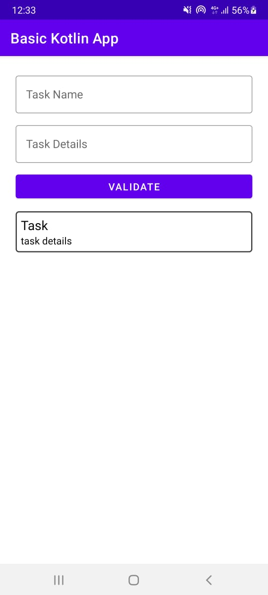
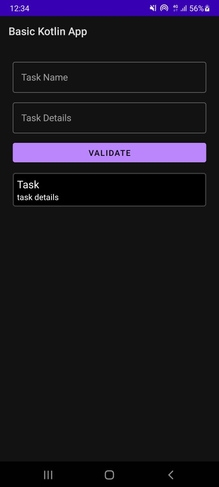
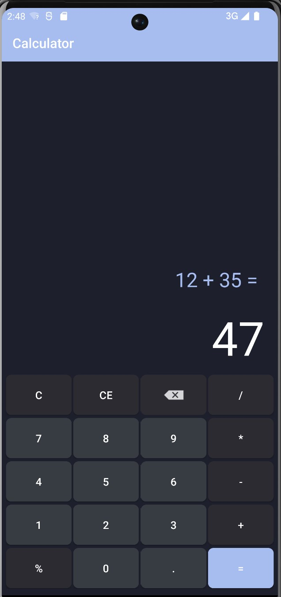

# Learn Android Application Development

### [Basic java app](./basic-java-app) & [Basic Kotlin app](./basic-kotlin-app):

A basic java/kotlin app that:
- read inputs *(task)*,
- store data in database,
- display it in a list.

Light mode version          |  Dark mode version
:-------------------------:|:-------------------------:
  |  

### [Calculator](./Calculator):

A simple calculator app for Android using MVVM and the Factory Design Pattern to choose the right operation.

## Contribute
To contribute to this project, please read the [CONTRIBUTING.md](./CONTRIBUTING.md) file before submitting a pull request.
